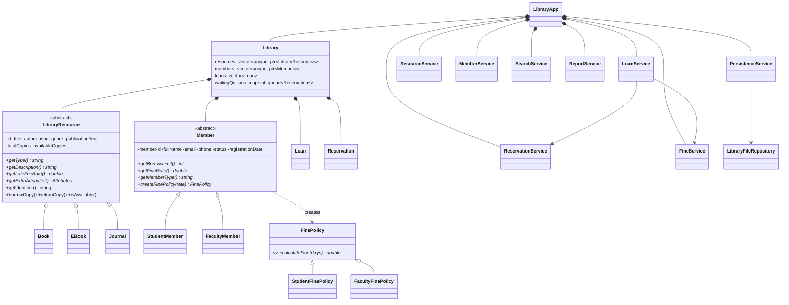

# Smart Library & Resource Management System

A digital library and media-resource manager (Topic 4). The **entire business logic is pure C++17**; the browser
UI is plain HTML/CSS/vanilla JavaScript that only displays data and calls a REST API.

> The data shipped on first run is **DEMO / SAMPLE data** (invented names, titles and loans). The UI and the reports label it as such.

## 1. Project overview

| Requirement | Where it lives |
|---|---|
| 1 Polymorphic resources (Book, EBook, Journal) | `models/LibraryResource` + `Book`, `EBook`, `Journal` |
| 2 Member types (Student, Faculty) | `models/Member` + `StudentMember`, `FacultyMember` |
| 3 Borrow & return workflow | `services/LoanService` |
| 4 Fine engine | `models/FinePolicy` + `services/FineService` |
| 5 Reservations + waiting queue | `services/ReservationService` (`std::queue<Reservation>` per resource) |
| 6 Search (`std::find_if`, `std::copy_if`) | `services/SearchService` |
| 7 Persistence + inventory report | `repositories/LibraryFileRepository`, `services/PersistenceService`, `services/ReportService` |

## 2. Features
Resources, members, borrow/return with validation, polymorphic late fines, reservation queue with "next member is ready",
case-insensitive partial search, auto-save after every change, text/CSV inventory reports, dashboard with charts,
responsive UI (sidebar → icon rail → drawer; tables → cards on mobile), toasts, confirmation modals, safe "reset demo data".

## 3. Architecture

```
            WEB UI  (frontend/  - display + requests only)
               │  fetch()  JSON
               ▼
       HTTP / REST   utils/HttpServer (sockets, router)  +  controllers/*
               │
               ▼
   C++ APPLICATION LAYER   services/*   (LoanService, ReservationService, ...)
               │
               ▼
   C++ DOMAIN              models/*     (Library, LibraryResource, Member, Loan, ...)
               │
               ▼
   PERSISTENCE             repositories/LibraryFileRepository  → backend/data/*.txt
```
* The **C++ backend is the single source of truth**; the frontend contains no business rules (it even shows backend error text verbatim).
* `smartlibrary_core` (models, services, repositories) has **no dependency on HTTP**, so every rule is unit-tested without a server.
* `LibraryApp` is the composition root: one `Library` plus the focused services. No class is a "god class"; the largest service is ~200 lines.
* **Auto-save:** `Library` exposes a change listener (Observer). Services call `library.notifyChanged()` after each successful mutation and `main.cpp` wires it to `PersistenceService::save()`.
* All requests are handled one at a time (a mutex around the router), so there are no data races on the in-memory library.

### Why this fine architecture?
`FinePolicy` (abstract) with `StudentFinePolicy` and `FacultyFinePolicy`; the base rate comes from the resource.
Two independent polymorphic axes are combined by composition: `resource.getLateFeeRate()` × `member.createFinePolicy(rate)`.
The alternative `Student×Book`, `Faculty×Journal`, … class matrix would need 6 classes and grow multiplicatively.
`Member::createFinePolicy` is a Factory Method, so `FineService` never switches on a type string.

| | Book | EBook | Journal |
|---|---|---|---|
| rate / day | $0.50 | $0.20 | $1.00 |

Student: full rate from day 1 (limit 3 loans, 14 days). Faculty: 3 grace days, then 50% of the rate (limit 10 loans, 30 days).
Example: faculty, book, 10 days late → (10 − 3) × 0.50 × 0.5 = **$1.75**.

## 4. Class diagram



Plain-text version:
```
LibraryResource <|-- Book | EBook | Journal        Member <|-- StudentMember | FacultyMember
FinePolicy      <|-- StudentFinePolicy | FacultyFinePolicy
Library ◆-- Resources, Members, Loans, Reservations (waiting queues)
Services: ResourceService MemberService LoanService ReservationService SearchService FineService ReportService PersistenceService
```

## 5. OOP concepts demonstrated

| Concept | Where |
|---|---|
| **Abstraction** | `LibraryResource`, `Member`, `FinePolicy` (pure virtual methods) |
| **Inheritance** | `Book/EBook/Journal : LibraryResource`; `StudentMember/FacultyMember : Member` |
| **Polymorphism** | `std::vector<std::unique_ptr<LibraryResource>>`; `getType/getDescription/getLateFeeRate`, `getBorrowLimit`, `createFinePolicy`, `calculateFine` resolved at run time; `Journal` also overrides `getIdentifier()` (ISSN instead of ISBN) |
| **Encapsulation** | private fields; copies change only via `borrowCopy/returnCopy/setTotalCopies`; constructors validate invariants |
| **Composition / association** | `Library` owns resources/members/loans/reservations; `LibraryApp` owns the services; `Loan` refers to members/resources by id |
| **STL** | `vector`, `map`, `queue`, `unique_ptr`, `optional`, `find_if`, `copy_if`, `transform`, `count_if`, `sort`, `remove_if` |
| **File I/O** | `ifstream/ofstream`, `std::filesystem` (atomic temp-file + rename) |
| **Exceptions** | `LibraryException` hierarchy → HTTP status in controllers |
| **Design patterns** | Factory (`ResourceFactory`, `MemberFactory`), Factory Method (`createFinePolicy`), Strategy (`FinePolicy`), Observer (change listener) |

## 6. REST API
All responses: `{"success": true, "message": "...", "data": {...}}` or `{"success": false, "message": "..."}` (HTTP 400/404/409/500).

| Method | Path | Purpose |
|---|---|---|
| GET | `/api/resources?q=&type=&availability=&genre=` | list / filter |
| GET/POST | `/api/resources`, `/api/resources/{id}` | detail (+history, queue) / create |
| PUT/DELETE | `/api/resources/{id}` | update / delete |
| GET | `/api/genres` | genre list for filters |
| GET/POST/PUT | `/api/members`, `/api/members/{id}` | list (`q,type,status`) / detail / create / update |
| GET | `/api/loans?status=active\|overdue\|returned&memberId=&resourceId=` | list |
| GET | `/api/loans/{id}`, `/api/loans/{id}/preview` | detail / due date, overdue days and fine before returning |
| POST | `/api/loans/borrow` `{memberId,resourceId}` | borrow |
| POST | `/api/loans/return` `{loanId[,memberId]}` | return (+fine, +"next member ready" notification) |
| POST | `/api/loans/{id}/pay-fine` | mark a fine as paid |
| GET/POST | `/api/reservations`, `/api/reservations/queues` | list / queues per resource |
| POST/DELETE | `/api/reservations`, `/api/reservations/{id}` | reserve / cancel |
| GET | `/api/search?query=` `title=` `author=` `isbn=` `genre=` `type=` `available=` | search (400 if empty) |
| GET | `/api/dashboard` | dashboard data |
| GET | `/api/reports/inventory`, `/api/reports/csv`, `/api/reports/analytics` | write `reports/inventory_report.txt/.csv`, analytics |
| POST | `/api/data/save`, `/api/data/load`, `/api/data/reset-demo` `{confirm:true}` | persistence |
| GET/PUT | `/api/settings`, GET `/api/health` | settings, status |

## 7. Data persistence
Files in `backend/data/`: `resources.txt`, `members.txt`, `loans.txt`, `reservations.txt`, `settings.txt`
(settings also stores the id counters, library name and the demo-data flag).

**Format: pipe-delimited text, one record per line** — human readable, diff-friendly, no third-party parser, trivial to explain.
`\ | newline` inside a field are escaped (`FieldCodec`). Resource subclass fields are stored as `key=value` columns, so a new
resource type needs no format change.
* **Load** at start-up (first run creates demo data). `load()` parses into a scratch `Library` and swaps it in only if *every* file is valid, so a corrupt file never half-loads (error names file and line).
* **Save** after every successful change and via `POST /api/data/save`. Each file is written to `*.tmp` and renamed.
* Reservation queues are rebuilt from `WAITING` rows in id order, so queue order survives a restart.

## 8. Frontend
`frontend/` — `index.html`, `css/style.css`, `css/responsive.css`, `js/{api,app,dashboard,resources,members,loans,reservations,search,reports,settings}.js`.
No framework, no CDN, no build step (icons are inline SVG, charts are SVG/CSS). The C++ server also serves these files.

## 9. How to build
Requirements: a C++17 compiler (GCC ≥ 9, Clang ≥ 10, MSVC 2019+). CMake ≥ 3.14 for the CMake route.

**Linux / macOS**
```bash
cmake -S . -B build
cmake --build build -j
```
**Windows (Visual Studio 2019/2022, "x64 Native Tools" prompt or PowerShell)**
```powershell
cmake -S . -B build
cmake --build build --config Release
# executables: build\Release\smartlibrary.exe  and  build\Release\smartlibrary_tests.exe
```
**Windows (MSYS2/MinGW)**: `cmake -S . -B build -G "MinGW Makefiles" && cmake --build build`
**Without CMake (Linux/macOS/MSYS2):** `make` (builds into `build-make/`).

## 10. How to run
```bash
./build/smartlibrary                 # Windows: build\Release\smartlibrary.exe
# open http://127.0.0.1:8080
```
Options: `--port N  --host IP  --data DIR  --reports DIR  --frontend DIR  --empty` (`--empty`: start with no data instead of demo data).
The server binds to `127.0.0.1` by default (local use only).

## 11. How to test
```bash
ctest --test-dir build --output-on-failure      # or: ./build/smartlibrary_tests      (make test)
python3 tests/e2e_api.py build/smartlibrary     # end-to-end over real HTTP incl. restart/persistence
# frontend smoke test (stub DOM, needs the server running on :8099 and Node.js, test tooling only):
node tests/frontend_smoke.js
```
27 unit tests cover: resource/member creation and validation, borrowing, borrow limits (student vs faculty), returning, fine calculation,
overdue status, reservation queue + priority + held copy + cancel, search, persistence round-trip + corruption safety, auto-save, reports,
polymorphism, demo data and the API envelopes.

## 12. Sample screenshots
_(placeholders — add your own)_  
`docs/screenshots/dashboard.png` · `resources.png` · `loans.png` · `reservations.png` · `reports.png` · `mobile.png`

## 13. Known limitations / future improvements
* READY reservations never expire (no pickup deadline); members cannot be deleted (only set INACTIVE/SUSPENDED).
* One global request lock and whole-state rewrite on each change: fine for a course project, not for large libraries.
* The HTTP layer is a minimal HTTP/1.1 server (no TLS, no keep-alive, no authentication/roles). Do not expose it to the internet.
* Search folds ASCII case only (`Nguyễn` ≠ `nguyễn`); no accent-insensitive matching.
* Fines are tracked as paid/unpaid per loan; there is no payment history.
* Ideas: authentication + librarian roles, pickup expiry, renewals, e-mail notifications, SQLite behind the same repository interface, i18n.
